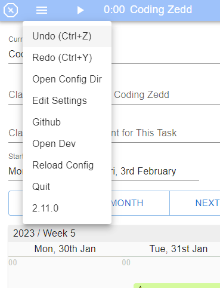
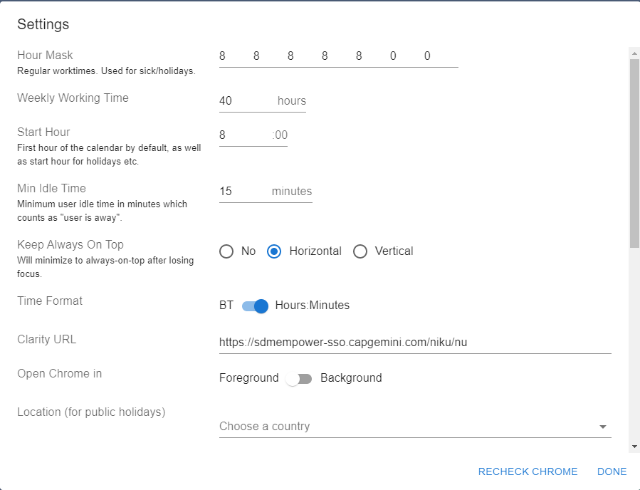
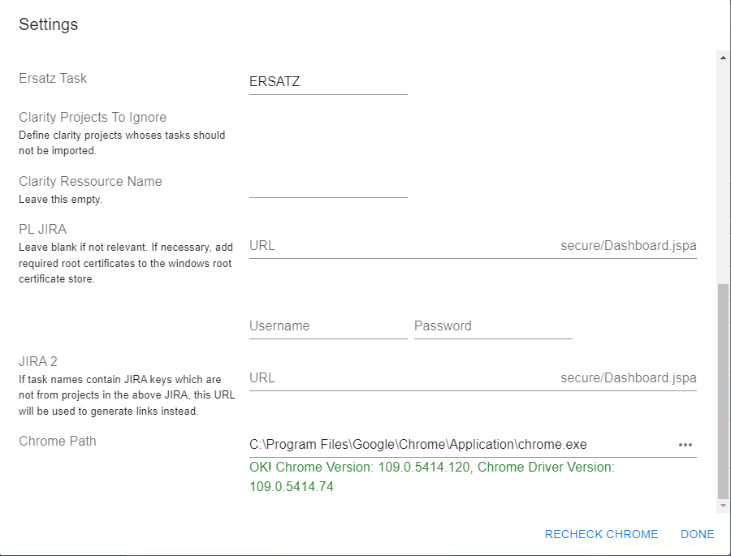

# Zedd-App 
>Custom time-tracking app with some very specific features. Built with Electron, TypeScript, React, MobX and MUI

## General Information 📝
- The application is designed to simplify work in the Clarity system
- It operates as an interactive calendar, where you can schedule tasks and manage your work time efficiently
- It has a user-friendly interface and features
- The goal is also to make work planning more organized, stress-free and friendly.

## Technologies Used 🚀
- React 18.2.0
- Electron 23.0.0
- TypeScript 4.5.5
- MobX 6.4.0
- MUI 5.4.2
- node.js 17.9.0

##  Screenshots 📺

## Features 📲
List of main features here:

- Task selection or input windows
- Main window with movable and stretchable task tiles
- Arrow buttons and buttons for changing days, weeks, or months
- Reservation button
- Trash button for deleting all reservations
- Three dashes button in the upper right corner for accessing and customizing the application settings
- Work time clock for the application with stop option
- Name change button
- Import button for importing data from the Clarity system.
- Summary window for work hours in the bottom part of the interface
- Submit button for sending the set information to the Clarity system with the option of automatic submission.

## Usage 🔥
- Use CTRL+LMB on the Calendar to add a new block or split an existing one.
- TimeSlice RMB -> "Eat Next/Prev" joins this slice with the next/prev, filling the gap.
- Use CTRL + Z on undo
- Use CTRL + Y on redo

##  Installation and development 🔧️
  To install and development the application, follow the instructions in the link:
  https://github.com/tobka777/zedd2/blob/main/CONTRIBUTING.md

## Project Status 🔨
Project is: _in progress_ 

##  Contact 🙋‍♂️
Contact person: [tobka777](https://github.com/tobka777)

## License ❗️
If accessing JIRA requires a root certificate, add it to the windows root certificate store, and it will be used.

