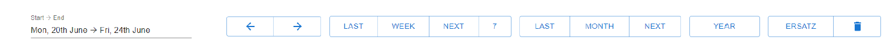

# Zedd-App

> The Zedd-app is a Grindstone-like application that automates booking in Clarity and simplifies working with multiple
> accounts. It operates as an interactive calendar, allowing you to schedule tasks and manage your work time
> efficiently.
> The goal is to make work planning more organized, stress-free, and user-friendly. Tasks can be linked to Jira tasks.
> The app is built with Electron, TypeScript, React, MobX, and MUI.

## Feature 📝

- Task selection or input windows
- Main window with movable and stretchable task tiles
- Arrow buttons and buttons for changing days, weeks, or months
- Reservation button
- Trash button for deleting all reservations
- Three dashes button in the upper right corner for accessing and customizing the application settings
- Work time clock for the application with stop option
- Name change button
- Import button for importing data from the Clarity system.
- Summary window for work hours in the bottom part of the interface
- Submit button for sending the set information to the Clarity system with the option of automatic submission.

## Screenshots 📺

## Usage 🔥

Press "IMPORT" "ALL" to import Clarity accounts. This needs to be repeated when new accounts are added to Clarity that
you want to book on. Usually, importing a single project is enough.

Enter what you are currently working on in "Currently Timing". This does not necessarily have to be a Clarity account.
If JIRA is configured, tickets from Jira will be suggested.

Enter the Clarity account for the task in "Clarity-Account for...". This can also be done retroactively/on Friday and is
retroactive.

Optionally, add a comment in "Clarity-Account Comment for...". The tag is automatically calculated and entered in
Clarity beforehand.

At the bottom, you can see what will be exported to Clarity. What is currently displayed will always be exported. The
"Autosubmit" checkbox next to the "Clarity" button will submit the timesheets as well.

### Tips and Tricks

| **COMMAND**                                       | **DESCRIPTION**                                 | 
|---------------------------------------------------|-------------------------------------------------|
| CTRL-click on an empty space in the calendar      | Adds a new "slice"                              |                                                                                                    |
| CTRL-click on an existing "slice" in the calendar | Divides it into two                             |                                                                                                    |
| ALT-click                                         | Sets the slice to the last used Clarity account | 
| CTRL-Z                                            | Undoes the last action                          | 
| CTRL-Y                                            | Will redo any previously-undone action          |
| Pressing the "Clarity" button                     | The current view is always booked.              | 

- To book the forecast:
    - Click "NEXT MONTH."
    - Click "ERSATZ."
    - Right-click on a slice, select "Other...," and choose the replacement account. (This step
      only needs to be done the first time).
    - Press the "CLARITY" button at the bottom.
      

- If you want to view the overtime hours of a month:
    - select the period of the month accordingly, or click NEXT
      MONTH
    - navigate using the LEFT or RIGHT buttons.

- At the bottom, the summary of all tasks and bookings including overtime/undertime is displayed:
  

## Download/ Installation 📥🔧️

### Windows/ MacOS

Download and run the latest _-Setup.exe_ file on [Github](https://github.com/tobka777/zedd2/releases/latest).

### Prerequisistesand && Publishing

To run the application from the IDE and publishing, follow the instructions in the link:
https://github.com/tobka777/zedd2/blob/main/CONTRIBUTING.md

## Contact 🙋‍♂️

Contact person: [tobka777](https://github.com/tobka777)

