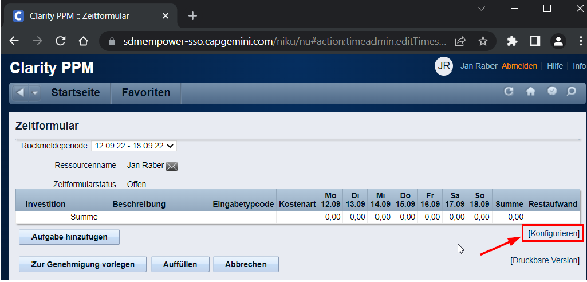
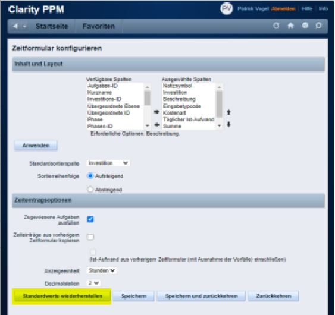

# Zedd-App

> The Zedd-app is a Grindstone-like application that automates booking in Clarity and simplifies working with multiple
> accounts. It operates as an interactive calendar, allowing you to schedule tasks and manage your work time
> efficiently.
> The goal is to make work planning more organized, stress-free, and user-friendly. Tasks can be linked to Jira tasks.
> The app is built with Electron, TypeScript, React, MobX, and MUI.

## Feature 📝

- Task selection or input windows
- Main window with movable and stretchable task tiles
- Arrow buttons and buttons for changing days, weeks, or months
- Reservation button
- Trash button for deleting all reservations
- Three dashes button in the upper right corner for accessing and customizing the application settings
- Work time clock for the application with stop option
- Name change button
- Import button for importing data from the Clarity system.
- Summary window for work hours in the bottom part of the interface
- Submit button for sending the set information to the Clarity system with the option of automatic submission.

## Screenshots 📺

## Usage 🔥

Press "IMPORT" "ALL" to import Clarity accounts. This needs to be repeated when new accounts are added to Clarity that
you want to book on. Usually, importing a single project is enough.

Enter what you are currently working on in "Currently Timing". This does not necessarily have to be a Clarity account.
If PL-JIRA is configured, tickets from Jira will be suggested.

Enter the Clarity account for the task in "Clarity-Account for...". This can also be done retroactively/on Friday and is
retroactive.

Optionally, add a comment in "Clarity-Account Comment for...". The tag is automatically calculated and entered in
Clarity beforehand.

At the bottom, you can see what will be exported to Clarity. What is currently displayed will always be exported. The
"Autosubmit" checkbox next to the "Clarity" button will submit the timesheets as well.

#### Tips and Tricks

- CTRL-click on an empty space in the calendar adds a new "slice."
- CTRL-click on an existing "slice" in the calendar divides it into two.
- ALT-click sets the slice to the last used Clarity account.
- CTRL-Z undoes the last action.
- CTRL-Y repeats the last action.
- When pressing the "Clarity" button, the current view is always booked.
- To book the forecast:
    - Click "NEXT MONTH."
    - Click "ERSATZ."
    - Right-click on a slice, select "Other...," and choose the replacement account, such as _PN-ERSATZ-AZR_. (This step
      only needs to be done the first time).
    - Press the "CLARITY" button at the bottom.
      

- If you want to view the overtime hours of a month, you can select the period of the month accordingly, or click NEXT
  MONTH and then navigate using the LEFT or RIGHT buttons.

  At the bottom, the summary of all tasks and bookings including overtime/overtime is displayed:
  

## Download/ Installation 📥🔧️

### Windows

Download and run the latest _-Setup.exe_ file on [Github](https://github.com/tobka777/zedd2/releases/latest).

### MacOS

A version compiled for macOS can also be downloaded from [GitHub](https://github.com/tobka777/zedd2/releases/latest).
Additionally, with the following entry in the
Info.plist, the app can be marked as an agent, making it only visible in the status bar and not in the Dock:

Furthermore, it should be noted that "Foreground" is set in the settings:

Due to Apple devices being enrolled via Intelligent Hub, the OTP prompt occurs before logging into intranet services.
This must be done manually. The app waits and resumes processing once Clarity is reached.

### Prerequisistesand && Publishing

To run the application from the IDE and publishing, follow the instructions in the link:
https://github.com/tobka777/zedd2/blob/main/CONTRIBUTING.md

## Settings (RP-Specific)⚙️

| **Setting**                | **Value**                                                                                                                                                                                                                                                   | 
|----------------------------|-------------------------------------------------------------------------------------------------------------------------------------------------------------------------------------------------------------------------------------------------------------|
| Language in Clarity        | To use Zedd-App, the language setting in Clarity must be set to German. You can change this setting through https://sdmempower-sso.capgemini.com/niku/nu#action:personal.settings.                                                                          |                                                                                                    |
| Keep always on top         | To display what you are working on "always on top" as in Grindstone, select "Vertical" or "Horizontal".                                                                                                                                                     |                                                                                                    |
| Time Format                | Set to hours for the same view as Grindstone                                                                                                                                                                                                                | 
| Clarity URL                | https://sdmempower-sso.capgemini.com/niku/nu                                                                                                                                                                                                                | 
| Clarity Projects to Ignore | Select projects here on which you no longer want to book. These will then no longer be suggested, for example: BVAAZR3-BERATUNG-2019.                                                                                                                       |
| PL JIRA URL                | https://pl.local.vm/jira/, username and password correspond to your Windows login.[The Windows root certificate](https://pl.local.vm/confluence/display/TI/AZR-Root-CA+installieren#AZR-Root-CAinstallieren-InstallationinanderenBrowsern)  must be set up. | 
| JIRA 2                     | https://jira.zssi.ivbb.bund.de/                                                                                                                                                                                                                             | 

## Troubleshooting 😵‍

Clarity booking doesn't work

- Make sure that the default configuration for the timesheet columns is set and restore default values if necessary:
  
  

## Contact 🙋‍♂️

Contact person: [tobka777](https://github.com/tobka777)

## Similar articles 📜

- [Accounting- RP](https://pl.local.vm/confluence/display/BVA/Kontierung+-+RP) (Federal Office of Administration)
- [Accounting](https://pl.local.vm/confluence/display/BVA/Kontierung)>  (
  Federal Office of Administration)
- [Perform Clarity booking [BCK]](https://pl.local.vm/confluence/pages/viewpage.action?pageId=34177219) (Federal Office
  of Administration)
- [Accounting](https://pl.local.vm/confluence/display/BVA/Kontierung) (Federal Office of Administration)
- [Accounting [SB, BCK]]( https://pl.local.vm/confluence/pages/viewpage.action?pageId=6324698) (Federal Office of
  Administration)
- [Confluence - Usage - Group 1](https://pl.local.vm/confluence/display/BVA/Confluence+-+Nutzung+-+Gruppe+1) (Federal
  Office of Administration)