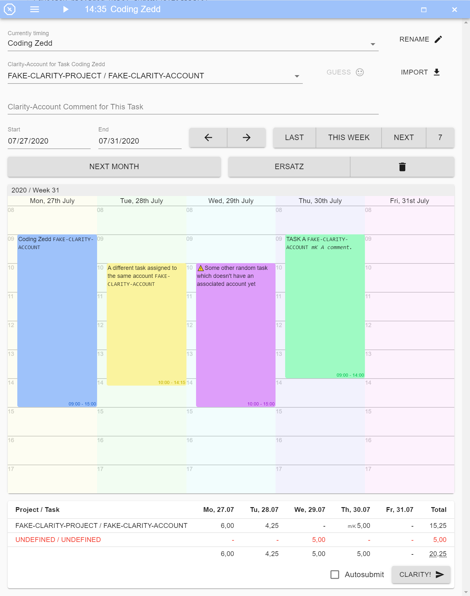
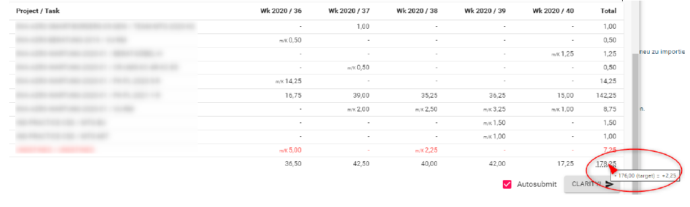

# Zedd-App

The Zedd-App is a Grindstone-like application that automates booking in Platform and simplifies working with multiple
accounts. It operates as an interactive calendar, allowing you to schedule tasks and manage your work time efficiently.

The goal is to make work planning more organized, stress-free and user-friendly. The app is built with Electron,
TypeScript, React, MobX, and MUI.

## Features 📝

- Working time tracking with integrated clock
- Summary window for working hours
- Overview of working time and overtime
- Automatic break of working time when computer is inactive
- Tasks can be exported to the Platform system with the option of automatic submission
- Export can also take place in the background
- Importing tasks from the Platform system
- Individual names for tasks that can be assigned to a Platform task and a comment
- Tasks can be linked to Jira tasks
- Forecast booking possible with "Ersatz" task
- Automatic detection of holidays by country and federal state

## Screenshots 📺

## Usage 🔥

Press the button `IMPORT` and select `ALL` in the dropdown to import Platform accounts. This needs to be repeated when
new accounts are added to Platform that you want to book on. Usually, importing a single project is enough.

Enter what you are currently working on in the field `Currently Timing`. This does not necessarily have to be a Platform
account.
If JIRA is configured, tickets from Jira will be suggested.

Enter the Platform account for the task in `Platform-Account for Task ...`. This can also be done later/Friday and is
retroactive.

Optionally, add a comment in `Platform-Account Comment for This Task`. The tag is automatically calculated and entered
in Platform beforehand.

At the bottom, you can see what will be exported to Platform. What is currently displayed will always be exported. The
`Autosubmit` checkbox next to the `Platform` button will submit the timesheets as well.

### Tips and Tricks

| **Command**                                         | **Description**                                  | 
|-----------------------------------------------------|--------------------------------------------------|
| **CTRL+Click** on an empty space in the calendar    | Adds a new slice                                 |
| **CTRL+Click** on an existing slice in the calendar | Divides it into two                              |
| **ALT+Click**                                       | Sets the slice to the last used Platform account | 
| **CTRL+Z**                                          | Undoes the last action                           | 
| **CTRL+Y**                                          | Will redo any previously-undone action           |
| Pressing the **Platform button**                    | The current view is booked in Platform.          | 
| **CTRL+C** on an existing slice in the calendar     | Copy slice                                       | 
| **CTRL+V** on an empty space in the calendar        | Paste slice at mouse pointer                     |

- To book the forecast:
  - Click `NEXT MONTH`
  - Click `ERSATZ`
  - Right-click on a slice, select `Other...` and choose the replacement account. (This step only needs to be done the
    first time.)
  - Press the `PLATFORM` button at the bottom.
    

- If you want to view the overtime hours of a month:
  - select the period of the month accordingly, or click `NEXT
      MONTH`
  - navigate using the `←` (left) or `→` (right) buttons.
  - at the bottom, the summary of all tasks and bookings including overtime/undertime is displayed:
    

### Jira Integration

The Zedd-App enables an integration of Jira. Thus, the issues can be used as names for the timeslots.
When searching for tasks, Jira is requested.

In the settings, the url of Jira must be entered under PL Jira.
The Personal Access Token must be generated in Jira (
see [Instructions](https://confluence.atlassian.com/enterprise/using-personal-access-tokens-1026032365.html)) and stored
in the Settings under Token.

## Download 📥

Download and run the latest release on [Github](https://github.com/tobka777/zedd2/releases/latest).

- Windows (exe): `zedd-app-<release>.Setup.exe`
- Windows (nupkg): `zedd-<release>-full.nupkg`
- Mac (zip): `zedd-app-darwin-x64-<release>.zip`

### Requirements

- [Chrome](https://www.google.com/chrome/de/download-chrome/) with version 115 or newer must be installed

## Contributing 👨‍🔧

Pull requests are welcome. For major changes, please open an [GitHub Issues](https://github.com/tobka777/zedd2/issues)
first to discuss what you would like to change.

If you want to contribute please read
our [Contribution Guide](https://github.com/tobka777/zedd2/blob/main/CONTRIBUTING.md).

## Contact 🙋

Contact person: [tobka777](https://github.com/tobka777)

